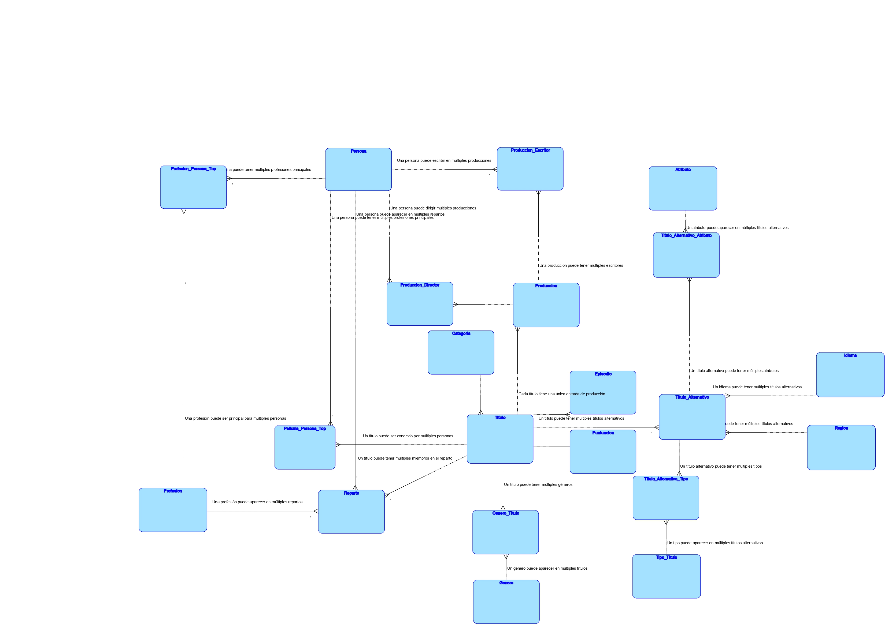

# Integrantes Grupo 5

| Nombre | Registro Académico  |
| --- | --- |
| Josseline Griselda Montecinos Hernández  | 202201534 |
| Pablo Andrés Rodríguez Lima | 202201947 |
| Carlos Manuel Lima y Lima | 202201524 |

# Repositorio General

[GitHub - PabloR03/-SDB2-Proyecto_G5: Entrega de Proyecto curso Sistemas de Bases de Datos 2](https://github.com/PabloR03/-SDB2-Proyecto_G5.git)

# Archivos Descargados

## **title.akas.tsv.gz** - Títulos Alternativos/Localizados

| **Campo** | **Qué Guarda** |
| --- | --- |
| **titleId** | Identificador único alfanumérico del título (tconst) - Clave foránea a títulos principales |
| **ordering** | Número entero para identificar únicamente cada fila por titleId - Manejo de múltiples versiones |
| **title** | Título localizado/alternativo - Cómo se conoce el título en diferentes regiones |
| **region** | Código de región/país donde se usa esta versión del título (ISO) |
| **language** | Idioma del título alternativo (códigos ISO de idioma) |
| **types** | Array de atributos del título alternativo: "alternative", "dvd", "festival", "tv", "video", "working", "original", "imdbDisplay" |
| **attributes** | Términos adicionales descriptivos no enumerados - Información extra sobre el título alternativo |
| **isOriginalTitle** | Booleano (0/1) - Indica si es el título original de la obra |

## **title.basics.tsv.gz** - Información Básica de Títulos

| **Campo** | **Qué Guarda** |
| --- | --- |
| **tconst** | Identificador único alfanumérico del título - Clave primaria universal de títulos |
| **titleType** | Tipo/formato del título: movie, short, tvseries, tvepisode, video, etc. - Categorización del contenido |
| **primaryTitle** | Título más popular/usado por realizadores en materiales promocionales - Título de exhibición principal |
| **originalTitle** | Título original en el idioma original de producción |
| **isAdult** | Contenido para adultos (0: no adulto; 1: adulto) - Clasificación de audiencia |
| **startYear** | Año de lanzamiento (YYYY). Para series TV es el año de inicio |
| **endYear** | Año de finalización para series TV (YYYY). '\N' para otros tipos de título |
| **runtimeMinutes** | Duración principal del título en minutos |
| **genres** | Array de hasta tres géneros asociados con el título - Clasificación temática |

## **title.crew.tsv.gz** - Equipo de Producción Principal

| **Campo** | **Qué Guarda** |
| --- | --- |
| **tconst** | Identificador único alfanumérico del título - Referencia al título |
| **directors** | Array de identificadores de personas (nconsts) que dirigieron el título |
| **writers** | Array de identificadores de personas (nconsts) que escribieron/guionizaron el título |

## **title.episode.tsv.gz** - Información de Episodios

| **Campo** | **Qué Guarda** |
| --- | --- |
| **tconst** | Identificador alfanumérico del episodio específico - Clave primaria del episodio |
| **parentTconst** | Identificador alfanumérico de la serie TV padre - Relación jerárquica serie→episodio |
| **seasonNumber** | Número entero de temporada a la que pertenece el episodio |
| **episodeNumber** | Número entero del episodio dentro de la serie TV |

## **title.principals.tsv.gz** - Reparto y Equipo Principal

| **Campo** | **Qué Guarda** |
| --- | --- |
| **tconst** | Identificador único alfanumérico del título - Referencia al título |
| **ordering** | Número entero para identificar únicamente filas por titleId - Orden de importancia en créditos |
| **nconst** | Identificador único alfanumérico de la persona - Referencia a base de datos de personas |
| **category** | Categoría del trabajo realizado por la persona (actor, director, writer, producer, etc.) |
| **job** | Título específico del trabajo si aplica, sino '\N' - Trabajo detallado (ej: "Executive Producer") |
| **characters** | Nombre del personaje interpretado si aplica, sino '\N' - Solo para actores/actrices |

## **title.ratings.tsv.gz** - Calificaciones y Votaciones

| **Campo** | **Qué Guarda** |
| --- | --- |
| **tconst** | Identificador único alfanumérico del título - Referencia al título calificado |
| **averageRating** | Promedio ponderado de todas las calificaciones individuales de usuarios (escala 1-10) |
| **numVotes** | Número total de votos que ha recibido el título - Indicador de popularidad |

## **name.basics.tsv.gz** - Información de Personas

| **Campo** | **Qué Guarda** |
| --- | --- |
| **nconst** | Identificador único alfanumérico de la persona - Clave primaria de personas |
| **primaryName** | Nombre por el cual la persona es más frecuentemente acreditada - Nombre profesional |
| **birthYear** | Año de nacimiento en formato YYYY |
| **deathYear** | Año de muerte en formato YYYY si aplica, sino '\N' - Para personas fallecidas |
| **primaryProfession** | Array de strings con las top-3 profesiones de la persona - Actividades principales |
| **knownForTitles** | Array de identificadores de títulos (tconsts) por los cuales la persona es conocida - Trabajos más relevantes |

# Tablas

## Categoría

| Campo | Que Guarda |  |
| --- | --- | --- |
| id_categoría | Identificador único  |  |
| nombre | nombre de la categoría | Tipo/formato del título: movie, short, tvseries, tvepisode, video, etc. - Categorización del contenido |

## Género

| Campo | Que Guarda |  |
| --- | --- | --- |
| id_genero | Identificador único  |  |
| nombre | nombre del genero | Comedia, Drama, Acción, etc |

## Titulo

| **Campo** | **Qué Guarda** |
| --- | --- |
| **tconst
(PK)** | Identificador único alfanumérico del título - Clave primaria universal de títulos |
| id_categoría | Llave foránea a categoría  |
| **titulo_popular** | Título más popular/usado por realizadores en materiales promocionales - Título de exhibición principal |
| **titulo_original** | Título original en el idioma original de producción |
| es_contenido_adulto | Contenido para adultos (0: no adulto; 1: adulto) - Clasificación de audiencia |
| **anio_lanzamiento** | Año de lanzamiento (YYYY). Para series TV es el año de inicio |
| **anio_finalizacion** | Año de finalización para series TV (YYYY). '\N' para otros tipos de título |
| duracion_minutos | Duración principal del título en minutos |
| **generos** | Lista de generos |

## Titulo_Alternativo

| **Campo** | **Qué Guarda** |
| --- | --- |
| Id_tituloAlternativo (PK) | Identificador Unico |
| tconst (FK) | Identificador único alfanumérico del título - Referencia al título |
| orden | número para identificar de forma única las filas para un titulo determinado |
| nombre_titulo | nombre del titulo segun la region disponible |
| region | la región para esta versión del título |
| idioma | el idioma del título |
| tipo | Conjunto enumerado de atributos para este título alternativo. |
| atributo | Términos adicionales para describir este título alternativo, no enumerados |
| es_Original | 0: título no original; 1: título original |

## Equipo de Producción

| **Campo** | **Qué Guarda** |
| --- | --- |
| id_produccion | Identificador único |
| **tconst
(FK)** | Identificador único alfanumérico del título - Referencia al título |
| directores | Array de identificadores de personas (nconsts) que dirigieron el título |
| escritores | Array de identificadores de personas (nconsts) que escribieron/guionizaron el título |

## Episodio

| **Campo** | **Qué Guarda** |
| --- | --- |
| **tconst** | Identificador alfanumérico del episodio específico - Clave primaria del episodio |
| id_titulo
FK | Identificador alfanumérico de la serie TV padre - Relación jerárquica serie→episodio |
| temporada | Número entero de temporada a la que pertenece el episodio |
| **episodio** | Número entero del episodio dentro de la serie TV |

## Reparto

| **Campo** | **Qué Guarda** |
| --- | --- |
| id_reparto | Identificador único |
| **tconst
FK** | Identificador único alfanumérico del título - Referencia al título |
| relevancia | Número entero para identificar únicamente filas por titleId - Orden de importancia en créditos |
| **nconst
FK** | Identificador único alfanumérico de la persona - Referencia a base de datos de personas |
| categoría | Categoría del trabajo realizado por la persona (actor, director, writer, producer, etc.) |
| Rol | Título específico del trabajo si aplica, sino '\N' - Trabajo detallado (ej: "Executive Producer") |
| Personaje | Nombre del personaje interpretado si aplica, sino '\N' - Solo para actores/actrices |

## Puntuacion

| **Campo** | **Qué Guarda** |
| --- | --- |
| id_puntuacion |  |
| **tconst
FK** | Identificador único alfanumérico del título - Referencia al título calificado |
| promedio | Promedio ponderado de todas las calificaciones individuales de usuarios (escala 1-10) |
| votos | Número total de votos que ha recibido el título - Indicador de popularidad |

## Personas

| **Campo** | **Qué Guarda** |
| --- | --- |
| **nconst
PK** | Identificador único alfanumérico de la persona - Clave primaria de personas |
| nombre_artistico | Nombre por el cual la persona es más frecuentemente acreditada - Nombre profesional |
| **anio_nacimiento** | Año de nacimiento en formato YYYY |
| **anio_fallecimiento** | Año de muerte en formato YYYY si aplica, sino '\N' - Para personas fallecidas |
| **Profesiones Principales** | Array de strings con las top-3 profesiones de la persona - Actividades principales |
| Conocido Por Titulos | Array de identificadores de títulos (tconsts) por los cuales la persona es conocida - Trabajos más relevantes |

# Primera Forma Normal

Objetivo: Eliminar grupos repetitivos y garantizar valores atómicos

## Categoría

| Campo | Que Guarda |  |
| --- | --- | --- |
| id_categoría | Identificador único  |  |
| nombre | nombre de la categoría | Tipo/formato del título: movie, short, tvseries, tvepisode, video, etc. - Categorización del contenido |

## Género

| Campo | Que Guarda |  |
| --- | --- | --- |
| id_genero | Identificador único  |  |
| nombre | nombre del genero | Comedia, Drama, Acción, etc
 |

## Titulo

- **ELIMINADO**: Campo `generos` (contenía múltiples valores separados por comas)
- **CREADA**: Tabla `Genero_Titulo` para manejar la relación muchos-a-muchos entre títulos y géneros
- **Razón**: El campo `generos` violaba la 1FN al contener múltiples valores en una sola celda

| **Campo** | **Qué Guarda** |
| --- | --- |
| **tconst (PK)** | Identificador único alfanumérico del título - Clave primaria universal de títulos |
| id_categoría | Llave foránea a categoría  |
| **titulo_popular** | Título más popular/usado por realizadores en materiales promocionales - Título de exhibición principal |
| **titulo_original** | Título original en el idioma original de producción |
| es_contenido_adulto | Contenido para adultos (0: no adulto; 1: adulto) - Clasificación de audiencia |
| **anio_lanzamiento** | Año de lanzamiento (YYYY). Para series TV es el año de inicio |
| **anio_finalizacion** | Año de finalización para series TV (YYYY). '\N' para otros tipos de título |
| duracion_minutos | Duración principal del título en minutos |

## Genero_Titulo

| **Campo** | **Qué Guarda** |
| --- | --- |
| id_genero_titulo (PK) | Identificador único |
| **tconst (FK)** | Identificador único alfanumérico del título - Clave primaria universal de títulos |
| id_genero (FK) | Genero del titulo  |

## **Titulo_Alternativo**

| **Campo** | **Qué Guarda** |
| --- | --- |
| Id_tituloAlternativo (PK) | Identificador único |
| tconst (FK) | Identificador único alfanumérico del título - Referencia al título |
| orden | Número para identificar de forma única las filas para un título determinado |
| nombre_titulo | Nombre del título según la región disponible |
| region | La región para esta versión del título |
| idioma | El idioma del título |
| tipo | Conjunto enumerado de atributos para este título alternativo |
| atributo | Términos adicionales para describir este título alternativo, no enumerados |
| es_Original | 0: título no original; 1: título original |

## Equipo de Producción

- **ELIMINADO**: Campo `directores` (contenía array de nconsts)
- **ELIMINADO**: Campo `escritores` (contenía array de nconsts)
- **CREADA**: Tabla `Produccion_Escritor` para descomponer el array de escritores
- **CREADA**: Tabla `Produccion_Director` para descomponer el array de directores
- **MODIFICADA**: Se mantuvo tabla `Produccion` como tabla base

| **Campo** | **Qué Guarda** |
| --- | --- |
| id_produccion (PK) | Identificador único |
| **tconst (FK)** | Identificador único alfanumérico del título - Referencia al título |

## Producion_Escritor

| Campo | Qué Guarda |  |
| --- | --- | --- |
| id_produccion_escritor  (PK) | Identificador único |  |
| id_persona (FK) | Llave Foranea Persona |  |
| id_produccion  (FK) | Llave Foranea Produccion |  |

## Producion_Director

| Campo | Qué Guarda |  |
| --- | --- | --- |
| id_produccion_director (PK) | Identificador único |  |
| id_persona  (FK) | Llave Foranea Persona |  |
| id_produccion (FK) | Llave Foranea Produccion |  |

## Episodio

| **Campo** | **Qué Guarda** |
| --- | --- |
| **tconst (PK)** | Identificador alfanumérico del episodio específico - Clave primaria del episodio |
| id_titulo (FK) | Identificador alfanumérico de la serie TV padre - Relación jerárquica serie→episodio |
| temporada | Número entero de temporada a la que pertenece el episodio |
| **episodio** | Número entero del episodio dentro de la serie TV |

## Reparto

**MODIFICADO**: Campo `nconst` cambió de FK a campo directo (preparación para normalización posterior)

| **Campo** | **Qué Guarda** |
| --- | --- |
| id_reparto (PK) | Identificador único |
| **tconst (FK)** | Identificador único alfanumérico del título - Referencia al título |
| relevancia | Número entero para identificar únicamente filas por titleId - Orden de importancia en créditos |
| **nconst (FK)** | Identificador único alfanumérico de la persona - Referencia a base de datos de personas |
| categoría | Categoría del trabajo realizado por la persona (actor, director, writer, producer, etc.) |
| Rol | Título específico del trabajo si aplica, sino '\N' - Trabajo detallado (ej: "Executive Producer") |
| Personaje | Nombre del personaje interpretado si aplica, sino '\N' - Solo para actores/actrices |

## Puntuacion

| **Campo** | **Qué Guarda** |
| --- | --- |
| id_puntuacion (PK) | Identificador único |
| **tconst (FK)** | Identificador único alfanumérico del título - Referencia al título calificado |
| promedio | Promedio ponderado de todas las calificaciones individuales de usuarios (escala 1-10) |
| votos | Número total de votos que ha recibido el título - Indicador de popularidad |

## Persona

- **ELIMINADO**: Campo `Profesiones Principales` (contenía array de profesiones)
- **ELIMINADO**: Campo `Conocido Por Titulos` (contenía array de tconsts)
- **CREADA**: Tabla `Profesion_Persona_Top` para las profesiones principales
- **CREADA**: Tabla `Titulo_Persona_Top` para los títulos por los que es conocida

| **Campo** | **Qué Guarda** |
| --- | --- |
| **nconst (PK)** | Identificador único alfanumérico de la persona - Clave primaria de personas |
| nombre_artistico | Nombre por el cual la persona es más frecuentemente acreditada - Nombre profesional |
| **anio_nacimiento** | Año de nacimiento en formato YYYY |
| **anio_fallecimiento** | Año de muerte en formato YYYY si aplica, sino '\N' - Para personas fallecidas |

## Profesion_Persona_Top

| Campo |  |  |
| --- | --- | --- |
| id_profesion_persona | Identificador único |  |
| **nconst (FK)** | persona |  |
| **tconst (FK)** | Profesión principal de la persona (sin normalizar) |  |

## Pelicula_Persona_Top

| Campo |  |  |
| --- | --- | --- |
| id_profesion_persona | Identificador único |  |
| **nconst (FK)** | persona |  |
| **tconst (FK)** | Título por el cual es conocida la persona |  |

# Segunda Forma Normal

## Categoría

| Campo | Que Guarda |  |
| --- | --- | --- |
| id_categoría | Identificador único  |  |
| nombre | nombre de la categoría | Tipo/formato del título: movie, short, tvseries, tvepisode, video, etc. - Categorización del contenido |

## Género

| Campo | Que Guarda |  |
| --- | --- | --- |
| id_genero | Identificador único  |  |
| nombre | nombre del genero | Comedia, Drama, Acción, etc |

## Profesion

- **Origen**: Nace de la necesidad de normalizar el campo `categoría` en la tabla Reparto
- **Razón**: El campo `categoría` contenía valores repetitivos (actor, director, writer, producer) que debían normalizarse para evitar redundancia y garantizar consistencia

| **Campo** | **Qué Guarda: Actor, Director,** |
| --- | --- |
| id_profesion (PK) | Identificador único |
| nombre | nombre de la profesión |

## Titulo

| **Campo** | **Qué Guarda** |
| --- | --- |
| **tconst (PK)** | Identificador único alfanumérico del título - Clave primaria universal de títulos |
| id_categoría (FK) | Llave foránea a categoría  |
| **titulo_popular** | Título más popular/usado por realizadores en materiales promocionales - Título de exhibición principal |
| **titulo_original** | Título original en el idioma original de producción |
| es_contenido_adulto | Contenido para adultos (0: no adulto; 1: adulto) - Clasificación de audiencia |
| **anio_lanzamiento** | Año de lanzamiento (YYYY). Para series TV es el año de inicio |
| **anio_finalizacion** | Año de finalización para series TV (YYYY). '\N' para otros tipos de título |
| duracion_minutos | Duración principal del título en minutos |

## Genero_Titulo

| **Campo** | **Qué Guarda** |
| --- | --- |
| id_genero_titulo (PK) | Identificador único |
| **tconst (FK)** | Identificador único alfanumérico del título - Clave primaria universal de títulos |
| id_genero (FK) | Genero del titulo  |

## Titulo_Alternativo

- Cambiar campos repetitivos por **FK** (id_region, id_idioma, id_tipo)

| **Campo** | **Qué Guarda** |
| --- | --- |
| Id_tituloAlternativo (PK) | Identificador único |
| tconst (FK) | Referencia al título |
| orden | Número de orden del título alternativo |
| nombre_titulo | Nombre del título según la región |
| id_region (FK) | Referencia a la región |
| id_idioma (FK) | Referencia al idioma |
| id_tipo (FK) | Referencia al tipo de título |
| atributo | Términos adicionales descriptivos |
| es_Original | Indica si es título original |

## Region

- Separar **region** → tabla **Region** independiente

| **Campo** | **Qué Guarda** |
| --- | --- |
| id_region (PK) | Identificador único de región |
| codigo | Código de región (DE, US, HU, GR) |

## Idioma

- Separar **idioma** → tabla **Idioma** independiente

| **Campo** | **Qué Guarda** |
| --- | --- |
| id_idioma (PK) | Identificador único de idioma |
| codigo | Código de idioma (EN, ES, etc.) |

## Tipo_Titulo

- Separar **tipo** → tabla **Tipo_Titulo** independiente

| **Campo** | **Qué Guarda** |
| --- | --- |
| id_tipo (PK) | Identificador único de tipo |
| nombre | Nombre del tipo (original, imdbDisplay) |

## Equipo de Producción

| **Campo** | **Qué Guarda** |
| --- | --- |
| id_produccion (PK) | Identificador único |
| **tconst (FK)** | Identificador único alfanumérico del título - Referencia al título |

## Producion_Escritor

| Campo | Qué Guarda |  |
| --- | --- | --- |
| id_produccion_escritor  (PK) | Identificador único |  |
| id_persona (FK) | Llave Foranea Persona |  |
| id_produccion  (FK) | Llave Foranea Produccion |  |

## Producion_Director

| Campo | Qué Guarda |  |
| --- | --- | --- |
| id_produccion_director (PK) | Identificador único |  |
| id_persona  (FK) | Llave Foranea Persona |  |
| id_produccion (FK) | Llave Foranea Produccion |  |

## Episodio

| **Campo** | **Qué Guarda** |
| --- | --- |
| **tconst (PK)** | Identificador alfanumérico del episodio específico - Clave primaria del episodio |
| id_titulo (FK) | Identificador alfanumérico de la serie TV padre - Relación jerárquica serie→episodio |
| temporada | Número entero de temporada a la que pertenece el episodio |
| **episodio** | Número entero del episodio dentro de la serie TV |

## Reparto

- **ELIMINADO**: Campo `categoría` (contenía texto directo como "actor", "director")
- **AGREGADO**: Campo `id_profesion (FK)` que referencia a la nueva tabla Profesion

| **Campo** | **Qué Guarda** |
| --- | --- |
| id_reparto (PK) | Identificador único |
| **tconst (FK)** | Identificador único alfanumérico del título - Referencia al título |
| relevancia | Número entero para identificar únicamente filas por titleId - Orden de importancia en créditos |
| **nconst (FK)** | Identificador único alfanumérico de la persona - Referencia a base de datos de personas |
| id_profesion (FK) | Referencia a profesión |
| Rol | Título específico del trabajo si aplica, sino '\N' - Trabajo detallado (ej: "Executive Producer") |
| Personaje | Nombre del personaje interpretado si aplica, sino '\N' - Solo para actores/actrices |

## Puntuacion

| **Campo** | **Qué Guarda** |
| --- | --- |
| id_puntuacion (PK) | Identificador único |
| **tconst (FK)** | Identificador único alfanumérico del título - Referencia al título calificado |
| promedio | Promedio ponderado de todas las calificaciones individuales de usuarios (escala 1-10) |
| votos | Número total de votos que ha recibido el título - Indicador de popularidad |

## Persona

| **Campo** | **Qué Guarda** |
| --- | --- |
| **nconst (PK)** | Identificador único alfanumérico de la persona - Clave primaria de personas |
| nombre_artistico | Nombre por el cual la persona es más frecuentemente acreditada - Nombre profesional |
| **anio_nacimiento** | Año de nacimiento en formato YYYY |
| **anio_fallecimiento** | Año de muerte en formato YYYY si aplica, sino '\N' - Para personas fallecidas |

## Profesion_Persona_Top

- **ELIMINADO**: Campo `profesion` (contenía texto directo de profesión)
- **AGREGADO**: Campo `id_profesion (FK)` que referencia a la tabla Profesion
- **RAZÓN**: Normalizar las profesiones para evitar duplicación de datos

| Campo |  |  |
| --- | --- | --- |
| id_profesion_persona | Identificador único |  |
| **nconst (FK)** | persona |  |
| id_profesion (FK) |  |  |

## Pelicula_Persona_Top

| Campo |  |  |
| --- | --- | --- |
| id_profesion_persona | Identificador único |  |
| **nconst (FK)** | persona |  |
| **tconst (FK)** | id del titulo |  |

# Tercera Forma Normal

### **ANÁLISIS**: No se requirieron cambios estructurales

- **RAZÓN**: La estructura de 2FN ya cumplía con los requisitos de 3FN
- **VERIFICACIÓN**: No existen dependencias transitivas en el diseño
    - Todos los atributos no clave dependen directamente de sus claves primarias
    - No hay atributos que dependan de otros atributos no clave

## Categoria

| **Campo** | **Descripción del Campo** | **Nombre Original en Inglés** | **Tipo de Datos** |
| --- | --- | --- | --- |
| id_categoria | Identificador único de categoría | *Campo artificial - no existe en archivos* | SERIAL PRIMARY KEY |
| nombre | Tipo/formato del título | `titleType` (de title.basics.tsv.gz) | VARCHAR(50) NOT NULL |

## Genero

| **Campo** | **Descripción del Campo** | **Nombre Original en Inglés** | **Tipo de Datos** |
| --- | --- | --- | --- |
| id_genero | Identificador único de género | *Campo artificial - no existe en archivos* | SERIAL PRIMARY KEY |
| nombre | Nombre del género cinematográfico | `genres` (extraído de title.basics.tsv.gz) | VARCHAR(50) NOT NULL |

## Titulo

| **Campo** | **Descripción del Campo** | **Nombre Original en Inglés** | **Tipo de Datos** |
| --- | --- | --- | --- |
| tconst | Identificador único del título (PK) | `tconst` (de title.basics.tsv.gz) | VARCHAR(20) PRIMARY KEY |
| id_categoria | Llave foránea a categoría | `titleType` (de title.basics.tsv.gz) | INTEGER REFERENCES Categoria(id_categoria) |
| titulo_popular | Título principal/más conocido | `primaryTitle` (de title.basics.tsv.gz) | TEXT NOT NULL |
| titulo_original | Título en idioma original | `originalTitle` (de title.basics.tsv.gz) | TEXT |
| es_contenido_adulto | Indicador de contenido adulto | `isAdult` (de title.basics.tsv.gz) | BOOLEAN |
| anio_lanzamiento | Año de lanzamiento o inicio | `startYear` (de title.basics.tsv.gz) | INTEGER |
| anio_finalizacion | Año de finalización (series) | `endYear` (de title.basics.tsv.gz) | INTEGER |
| duracion_minutos | Duración en minutos | `runtimeMinutes` (de title.basics.tsv.gz) | INTEGER |

## Genero_Titulo

| **Campo** | **Descripción del Campo** | **Nombre Original en Inglés** | **Tipo de Datos** |
| --- | --- | --- | --- |
| id_genero_titulo | Identificador único (PK) | *Campo artificial - no existe en archivos* | SERIAL PRIMARY KEY |
| tconst | Referencia al título (FK) | `tconst` (de title.basics.tsv.gz) | VARCHAR(20) REFERENCES Titulo(tconst) |
| id_genero | Referencia al género (FK) | `genres` (procesado de title.basics.tsv.gz) | INTEGER REFERENCES Genero(id_genero) |

## Titulo_Alternativo

- Cambiar campo `atributo` por **FK** (id_atributo)

| **Campo** | **Descripción** | **Tipo de Dato** |
| --- | --- | --- |
| Id_tituloAlternativo | Identificador único (PK) | INT |
| tconst | Referencia al título (FK) | VARCHAR(10) |
| orden | Número de orden | INT |
| nombre_titulo | Nombre del título | VARCHAR(255) |
| id_region | Referencia a región (FK) | INT |
| id_idioma | Referencia a idioma (FK) | INT |
| es_Original | Indica si es original | BOOLEAN |

## Titulo_Alternativo_Atributo

| **Campo** | **Descripción del Campo** | **Tipo de Datos** |
| --- | --- | --- |
| id_Titulo_Alternativo_Atributo | Identificador único (PK) | SERIAL PRIMARY KEY |
| id_titulo_alternativo | Referencia a Título_Alternativo (FK) | INT REFERENCES Título_Alternativo(Id_tituloAlternativo) |
| id_atributo | Referencia a Atributo (FK) | INT REFERENCES Atributo(id_atributo) |

## Título_Alternativo_Tipo

| **Campo** | **Descripción del Campo** | **Tipo de Datos** |
| --- | --- | --- |
| id_Titulo_Alternativo_Atributo | Identificador único (PK) | SERIAL PRIMARY KEY |
| id_titulo_alternativo | Referencia a Título_Alternativo (FK) | INT REFERENCES Título_Alternativo(Id_tituloAlternativo) |
| id_tipo | Referencia a Tipo_Título (FK) | INT REFERENCES Tipo_Título(id_tipo) |

## Region

| **Campo** | **Descripción** | **Tipo de Dato** |
| --- | --- | --- |
| id_region | Identificador único (PK) | INT |
| codigo | Código de región | VARCHAR(5) |

## Idioma

| **Campo** | **Descripción** | **Tipo de Dato** |
| --- | --- | --- |
| id_idioma | Identificador único (PK) | INT |
| codigo | Código de idioma | VARCHAR(5) |

## Tipo_Titulo

| **Campo** | **Descripción** | **Tipo de Dato** |
| --- | --- | --- |
| id_tipo | Identificador único (PK) | INT |
| nombre | Nombre del tipo | VARCHAR(50) |

## Atributo

- Separar **atributo** → tabla **Atributo** independiente

| **Campo** | **Descripción** | **Tipo de Dato** |
| --- | --- | --- |
| id_atributo | Identificador único (PK) | INT |
| nombre | Nombre del atributo | VARCHAR(100) |

## Produccion

| **Campo** | **Descripción del Campo** | **Nombre Original en Inglés** | **Tipo de Datos** |
| --- | --- | --- | --- |
| id_produccion | Identificador único (PK) | *Campo artificial - no existe en archivos* | SERIAL PRIMARY KEY |
| tconst | Referencia al título (FK) | `tconst` (de title.crew.tsv.gz) | VARCHAR(20) REFERENCES Titulo(tconst) |

## Produccion_Escritor

| **Campo** | **Descripción del Campo** | **Nombre Original en Inglés** | **Tipo de Datos** |
| --- | --- | --- | --- |
| id_produccion_escritor | Identificador único (PK) | *Campo artificial - no existe en archivos* | SERIAL PRIMARY KEY |
| id_persona | Referencia a persona (FK) | `writers` (procesado de title.crew.tsv.gz) | VARCHAR(20) REFERENCES Persona(nconst) |
| id_produccion | Referencia a producción (FK) | `tconst` (de title.crew.tsv.gz) | INTEGER REFERENCES Produccion(id_produccion) |

## Produccion_Director

| **Campo** | **Descripción del Campo** | **Nombre Original en Inglés** | **Tipo de Datos** |
| --- | --- | --- | --- |
| id_produccion_director | Identificador único (PK) | *Campo artificial - no existe en archivos* | SERIAL PRIMARY KEY |
| id_persona | Referencia a persona (FK) | `directors` (procesado de title.crew.tsv.gz) | VARCHAR(20) REFERENCES Persona(nconst) |
| id_produccion | Referencia a producción (FK) | `tconst` (de title.crew.tsv.gz) | INTEGER REFERENCES Produccion(id_produccion) |

## Episodio

| **Campo** | **Descripción del Campo** | **Nombre Original en Inglés** | **Tipo de Datos** |
| --- | --- | --- | --- |
| tconst | Identificador del episodio (PK) | `tconst` (de title.episode.tsv.gz) | VARCHAR(20) PRIMARY KEY |
| id_titulo | Referencia a serie padre (FK) | `parentTconst` (de title.episode.tsv.gz) | VARCHAR(20) REFERENCES Titulo(tconst) |
| temporada | Número de temporada | `seasonNumber` (de title.episode.tsv.gz) | INTEGER |
| episodio | Número de episodio | `episodeNumber` (de title.episode.tsv.gz) | INTEGER |

## Profesion

| **Campo** | **Descripción del Campo** | **Nombre Original en Inglés** | **Tipo de Datos** |
| --- | --- | --- | --- |
| id_profesion | Identificador único (PK) | *Campo artificial - no existe en archivos* | SERIAL PRIMARY KEY |
| nombre | Nombre de la profesión | `category` (de title.principals.tsv.gz) y `primaryProfession` (de name.basics.tsv.gz) | VARCHAR(100) NOT NULL |

## Reparto

| **Campo** | **Descripción del Campo** | **Nombre Original en Inglés** | **Tipo de Datos** |
| --- | --- | --- | --- |
| id_reparto | Identificador único (PK) | *Campo artificial - no existe en archivos* | SERIAL PRIMARY KEY |
| tconst | Referencia al título (FK) | `tconst` (de title.principals.tsv.gz) | VARCHAR(20) REFERENCES Titulo(tconst) |
| relevancia | Orden de importancia en créditos | `ordering` (de title.principals.tsv.gz) | INTEGER |
| nconst | Referencia a persona (FK) | `nconst` (de title.principals.tsv.gz) | VARCHAR(20) REFERENCES Persona(nconst) |
| id_profesion | Referencia a profesión (FK) | `category` (de title.principals.tsv.gz) | INTEGER REFERENCES Profesion(id_profesion) |
| rol | Trabajo específico detallado | `job` (de title.principals.tsv.gz) | TEXT |
| personaje | Personaje interpretado | `characters` (de title.principals.tsv.gz) | TEXT |

## Puntuacion

| **Campo** | **Descripción del Campo** | **Nombre Original en Inglés** | **Tipo de Datos** |
| --- | --- | --- | --- |
| id_puntuacion | Identificador único (PK) | *Campo artificial - no existe en archivos* | SERIAL PRIMARY KEY |
| tconst | Referencia al título (FK) | `tconst` (de title.ratings.tsv.gz) | VARCHAR(20) REFERENCES Titulo(tconst) |
| promedio | Calificación promedio (1.0-10.0) | `averageRating` (de title.ratings.tsv.gz) | DECIMAL(5,3) |
| votos | Número total de votos | `numVotes` (de title.ratings.tsv.gz) | INTEGER |

## Persona

| **Campo** | **Descripción del Campo** | **Nombre Original en Inglés** | **Tipo de Datos** |
| --- | --- | --- | --- |
| nconst | Identificador único de persona (PK) | `nconst` (de name.basics.tsv.gz) | VARCHAR(20) PRIMARY KEY |
| nombre_artistico | Nombre profesional/artístico | `primaryName` (de name.basics.tsv.gz) | TEXT NOT NULL |
| anio_nacimiento | Año de nacimiento | `birthYear` (de name.basics.tsv.gz) | INTEGER |
| anio_fallecimiento | Año de fallecimiento | `deathYear` (de name.basics.tsv.gz) | INTEGER |

## Profesion_Persona_Top

| **Campo** | **Descripción del Campo** | **Nombre Original en Inglés** | **Tipo de Datos** |
| --- | --- | --- | --- |
| id_profesion_persona | Identificador único (PK) | *Campo artificial - no existe en archivos* | SERIAL PRIMARY KEY |
| nconst | Referencia a persona (FK) | `nconst` (de name.basics.tsv.gz) | VARCHAR(20) REFERENCES Persona(nconst) |
| id_profesion | Referencia a profesión (FK) | `primaryProfession` (procesado de name.basics.tsv.gz) | INTEGER REFERENCES Profesion(id_profesion) |

## Pelicula_Persona_Top

| **Campo** | **Descripción del Campo** | **Nombre Original en Inglés** | **Tipo de Datos** |
| --- | --- | --- | --- |
| id_titulo_persona | Identificador único (PK) | *Campo artificial - no existe en archivos* | SERIAL PRIMARY KEY |
| nconst | Referencia a persona (FK) | `nconst` (de name.basics.tsv.gz) | VARCHAR(20) REFERENCES Persona(nconst) |
| tconst | Referencia a título (FK) | `knownForTitles` (procesado de name.basics.tsv.gz) | VARCHAR(20) REFERENCES Titulo(tconst) |

# Diagrama Entidad Relación

# Modelo Lógico

# Modelo Relacional

# Script Base de datos (PostgreSQL)

[-SDB2-Proyecto_G5/Fase 1/bd.sql at main · PabloR03/-SDB2-Proyecto_G5](https://github.com/PabloR03/-SDB2-Proyecto_G5/blob/main/Fase%201/bd.sql)

# Creación Base De Datos (Utilizando Docker)

[-SDB2-Proyecto_G5/Fase 1/docker-compose.yml at main · PabloR03/-SDB2-Proyecto_G5](https://github.com/PabloR03/-SDB2-Proyecto_G5/blob/main/Fase%201/docker-compose.yml)

# Script Separación Data

[-SDB2-Proyecto_G5/Fase 1/ManejoData/SepararDataTSV.py at main · PabloR03/-SDB2-Proyecto_G5](https://github.com/PabloR03/-SDB2-Proyecto_G5/blob/main/Fase%201/ManejoData/SepararDataTSV.py)

# Datos Separados

[Datos CSV - Google Drive](https://drive.google.com/drive/folders/1Gy2klp-7f6d0n-cCJdaGlnukhKznhyRx)

# Script Carga Produccion

[-SDB2-Proyecto_G5/Fase 1/CargaDatos/Carga_Producion.py at main · PabloR03/-SDB2-Proyecto_G5](https://github.com/PabloR03/-SDB2-Proyecto_G5/blob/main/Fase%201/CargaDatos/Carga_Producion.py)

# Script Carga Episodio

[-SDB2-Proyecto_G5/Fase 1/CargaDatos/Carga_Episodio.py at main · PabloR03/-SDB2-Proyecto_G5](https://github.com/PabloR03/-SDB2-Proyecto_G5/blob/main/Fase%201/CargaDatos/Carga_Episodio.py)

# Script Carga Puntuacion

[-SDB2-Proyecto_G5/Fase 1/CargaDatos/Carga_Puntuacion.py at main · PabloR03/-SDB2-Proyecto_G5](https://github.com/PabloR03/-SDB2-Proyecto_G5/blob/main/Fase%201/CargaDatos/Carga_Puntuacion.py)

# Script Carga Reparto

[-SDB2-Proyecto_G5/Fase 1/CargaDatos/Carga_Reparto.py at main · PabloR03/-SDB2-Proyecto_G5](https://github.com/PabloR03/-SDB2-Proyecto_G5/blob/main/Fase%201/CargaDatos/Carga_Reparto.py)

# Script Carga Genero_Titulo

[-SDB2-Proyecto_G5/Fase 1/CargaDatos/Carga_Genero_Titulo.py at main · PabloR03/-SDB2-Proyecto_G5](https://github.com/PabloR03/-SDB2-Proyecto_G5/blob/main/Fase%201/CargaDatos/Carga_Genero_Titulo.py)

# Script Carga Produccion_Escritor

[-SDB2-Proyecto_G5/Fase 1/CargaDatos/Carga_Produccion_Escritor.py at main · PabloR03/-SDB2-Proyecto_G5](https://github.com/PabloR03/-SDB2-Proyecto_G5/blob/main/Fase%201/CargaDatos/Carga_Produccion_Escritor.py)

# Script Carga Produccion_Director

[-SDB2-Proyecto_G5/Fase 1/CargaDatos/Carga_Produccion_Director.py at main · PabloR03/-SDB2-Proyecto_G5](https://github.com/PabloR03/-SDB2-Proyecto_G5/blob/main/Fase%201/CargaDatos/Carga_Produccion_Director.py)

# Script Carga Profesion_Persona_Top

[-SDB2-Proyecto_G5/Fase 1/CargaDatos/Carga_Profesion_Persona_Top.py at main · PabloR03/-SDB2-Proyecto_G5](https://github.com/PabloR03/-SDB2-Proyecto_G5/blob/main/Fase%201/CargaDatos/Carga_Profesion_Persona_Top.py)

# Script Carga Pelicula_Persona_Top

[-SDB2-Proyecto_G5/Fase 1/CargaDatos/Carga_Pelicula_Persona_Top.py at main · PabloR03/-SDB2-Proyecto_G5](https://github.com/PabloR03/-SDB2-Proyecto_G5/blob/main/Fase%201/CargaDatos/Carga_Pelicula_Persona_Top.py)

# Script Carga Titulo_Alternativo

[-SDB2-Proyecto_G5/Fase 1/CargaDatos/Carga_Titulo_Alternativo.py at main · PabloR03/-SDB2-Proyecto_G5](https://github.com/PabloR03/-SDB2-Proyecto_G5/blob/main/Fase%201/CargaDatos/Carga_Titulo_Alternativo.py)

# Script Carga Titulo_Alternativo_Atributo

[-SDB2-Proyecto_G5/Fase 1/CargaDatos/Cargar_Titulo_Alternativo_Atributo.py at main · PabloR03/-SDB2-Proyecto_G5](https://github.com/PabloR03/-SDB2-Proyecto_G5/blob/main/Fase%201/CargaDatos/Cargar_Titulo_Alternativo_Atributo.py)

# Script Carga Titulo_Alternativo_Tipo

[-SDB2-Proyecto_G5/Fase 1/CargaDatos/Cargar_Titulo_Alternativo_Tipo.py at main · PabloR03/-SDB2-Proyecto_G5](https://github.com/PabloR03/-SDB2-Proyecto_G5/blob/main/Fase%201/CargaDatos/Cargar_Titulo_Alternativo_Tipo.py)

# Consultas

## Stored procedure para mostrar toda la información de un titulo

[-SDB2-Proyecto_G5/Fase 1/Consultas/Info_Titulo.sql at main · PabloR03/-SDB2-Proyecto_G5](https://github.com/PabloR03/-SDB2-Proyecto_G5/blob/main/Fase%201/Consultas/Info_Titulo.sql)

## Stored procedure de peliculas de un director

[-SDB2-Proyecto_G5/Fase 1/Consultas/Titulo_Director.sql at main · PabloR03/-SDB2-Proyecto_G5](https://github.com/PabloR03/-SDB2-Proyecto_G5/blob/main/Fase%201/Consultas/Titulo_Director.sql)

## Top 10 peliculas con mejor Rating

[-SDB2-Proyecto_G5/Fase 1/Consultas/Top_Pelicula.sql at main · PabloR03/-SDB2-Proyecto_G5](https://github.com/PabloR03/-SDB2-Proyecto_G5/blob/main/Fase%201/Consultas/Top_Pelicula.sql)

## Director Con mas peliculas

[-SDB2-Proyecto_G5/Fase 1/Consultas/Director_Mas_Peliculas.sql at main · PabloR03/-SDB2-Proyecto_G5](https://github.com/PabloR03/-SDB2-Proyecto_G5/blob/main/Fase%201/Consultas/Director_Mas_Peliculas.sql)

## Top 10 de actores con mas peliculas

[-SDB2-Proyecto_G5/Fase 1/Consultas/Top_Actor.sql at main · PabloR03/-SDB2-Proyecto_G5](https://github.com/PabloR03/-SDB2-Proyecto_G5/blob/main/Fase%201/Consultas/Top_Actor.sql)